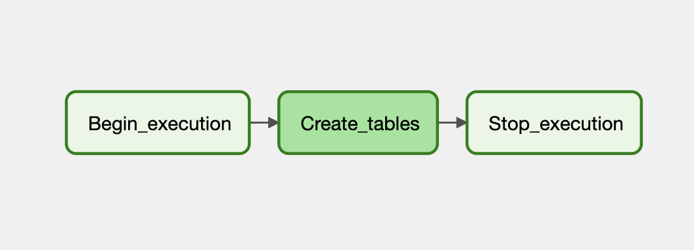
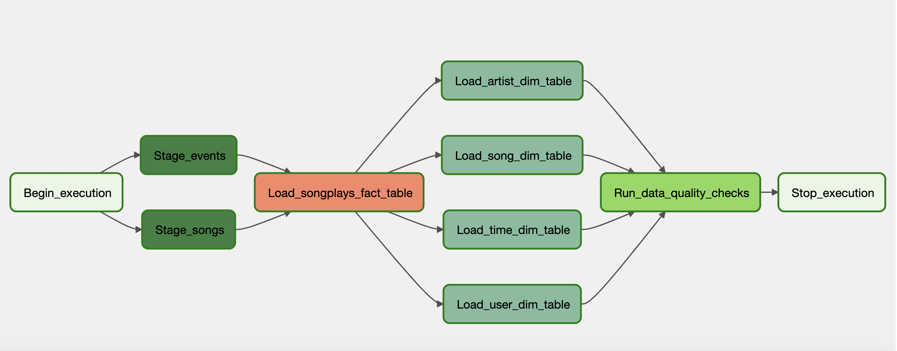

# Data Pipelines with Airflow

## Datasets

Two datasets are used for this project:

- Log Data: s3://udacity-dend/log_data
- Song Data: s3://udacity-dend/song_data

## DAGs:

- create_tables.py: A DAG that creates the required tables in Redshift.
  
- final_project.py: The main ETL DAG that orchestrates the data pipeline.
  

## Operators:

- RedshiftSQLOperator: Custom operator to run multiple SQL queries on Redshift, used for table creation and data transformation.
- StageToRedshiftOperator: Stages data from S3 to Redshift.
- LoadFactOperator: Loads data into fact tables.
- LoadDimensionOperator: Loads data into dimension tables with support for both append and truncate-insert operations.
- DataQualityOperator: Performs data quality checks by running specified SQL queries.

## Setup

1. Set up the Datasets: Copy the log and song data to your own S3 bucket.
2. Configure Redshift and Airflow:
   - Create a Redshift cluster and note the connection details.
   - Set up Airflow and create connections for AWS and Redshift.
3. Run the DAGs:
   1. Run the create_tables.py to create the necessary tables in Redshift
   2. Run the ETL DAG final_project.py to process the data, load it into Redshift, and perform data quality checks.

## DAGS Overview

create_tables_dag.py
This DAG runs SQL statements to create the following tables in Redshift:

- Staging tables: staging_events, staging_songs
- Fact table: songplays - Dimension tables: users, songs, artists, time

final_project.py
This DAG orchestrates the following steps:

- Staging data from S3 to Redshift using the StageToRedshiftOperator. - Loading data into the songplays fact table.
- Loading data into dimension tables (users, songs, artists, time).
- Running data quality checks on the final tables to ensure there are no missing or invalid records.
